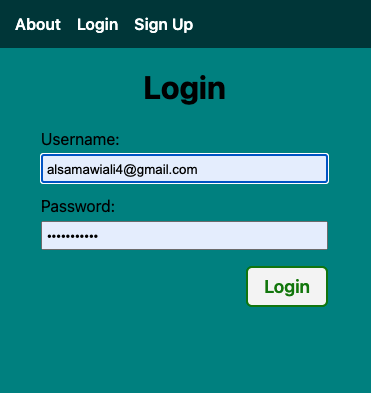
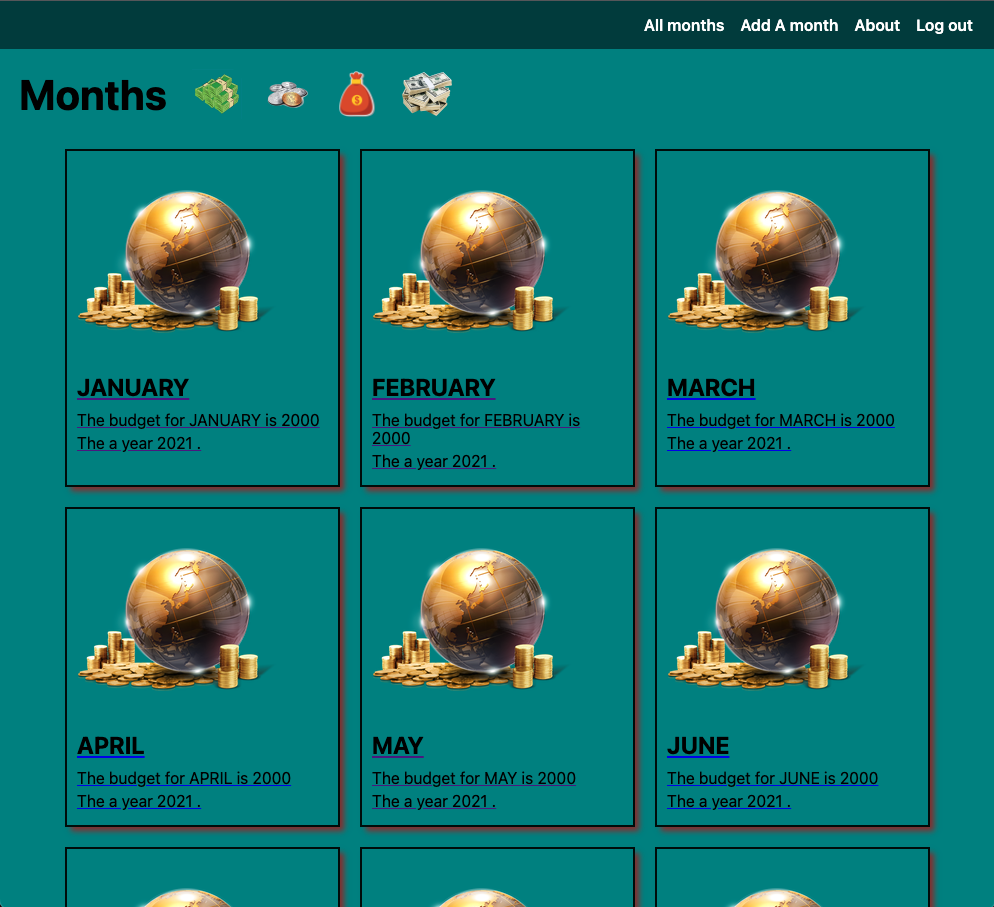
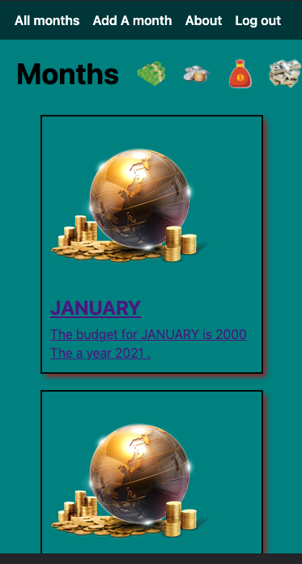
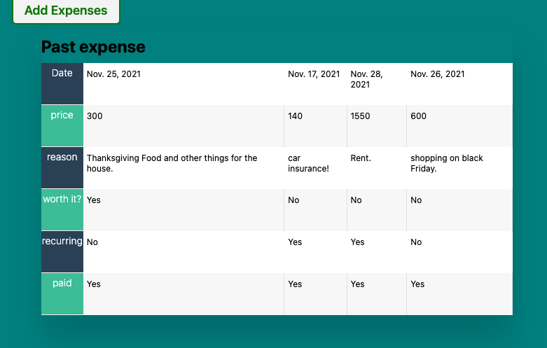

# Welcome to LOG IT #

## Getting Started : ##
  The Log it app is an app that will help you keep track of your expenses for each month. This will help you budget and reach your saving goal. This app will also help you keep track of things the reason for the expense and much more. Click on the button add a month to start. Select the month you want to start and start budgeting.

## Deployed link:

[click here!](https://budgetcollector.herokuapp.com/months/)

## Trello link:

[click here!](https://trello.com/b/77RmRL3l/budget-app)

## Technologies Used: ##
* Django
* Python 
* JavaScript
* PostgreSQL
* Html
* CSS
* Font Awesome
* Heroku

## Next Steps: ##
I Will like to add a delete functionality for my table in my expense model. This will allow users to delete expenses that they no longer need to remember. 

